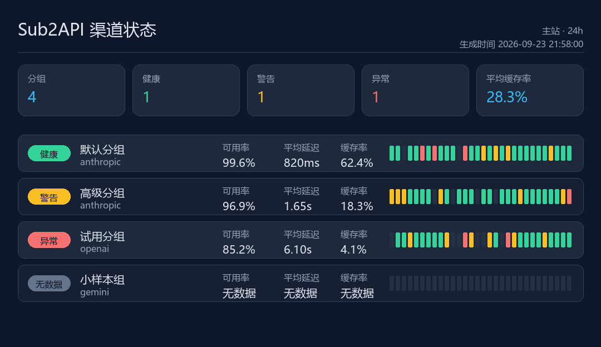

# AstrBot Sub2API 倍率查询插件

> 在 QQ 里一条命令，看清 Sub2API 所有分组的模型倍率、最低倍率，以及每个分组的渠道健康状态和缓存率。




*上图为 `/渠道图` 的输出示例（演示数据）。*

本插件通过 Sub2API 后台的 **管理员 API Key**（`x-api-key`）或 **面板 JWT**（`Authorization: Bearer`）读取分组倍率与渠道监控数据，整理成文字摘要或一张状态图，由 AstrBot 发送到 QQ。插件不包含 Sub2API 源码，只是一个只读的查询客户端。

- 上游项目：[Wei-Shaw/sub2api](https://github.com/Wei-Shaw/sub2api)

## 功能特性

| 能力   | 说明                                                       |
| ---- | -------------------------------------------------------- |
| 倍率总览 | 列出每个启用分组的平台、基础倍率，并单独标注高峰倍率与动态加成                          |
| 最低倍率 | 计算全部分组中最低的基础倍率，并列出对应的分组名                                 |
| 渠道状态 | 接入 Channel Monitor V2，显示每个分组的 `健康 / 警告 / 异常 / 无数据`       |
| 缓存率  | 显示分组的缓存命中率，未达最低样本量时诚实显示「无数据」                             |
| 渠道状态图 | `/渠道图` 把监控数据渲染成一张 PNG：KPI 汇总、可用率、平均延迟和最近 30 个时间桶        |
| 两种鉴权 | 管理员 API Key 或面板 JWT 二选一，至少配一个即可                            |
| 多实例  | 一份配置里可以挂多个 Sub2API 站点，一次命令全部查询                            |
| 容错   | 单个实例失败不影响其他实例的结果                                         |
| 消息分段 | 结果超出长度上限时自动按行分段发送，避免 QQ 截断                               |
| 缓存   | 可配置 TTL，避免频繁打上游接口                                         |
| 密钥安全 | API Key 与 JWT 不会出现在 QQ 消息或普通日志中                           |

## 前置条件

1. AstrBot `>= 4.10.4`，且已接入 `aiocqhttp`（QQ）适配器。
2. 一个可访问的 Sub2API 站点，并已准备 **管理员 API Key** 或 **面板 JWT**（二者至少一个）。
3. 站点已开启 **渠道监控**；若希望看到渠道状态和缓存率，需要选择 **V2 被动监控** 模式（详见下方「渠道监控没数据？」）。
4. 要生成渠道状态图，还需要 `Pillow` 和一份系统中文字体（多数系统自带）。

## 安装

方式一：在 AstrBot 插件市场搜索 `sub2api` 安装。

> 插件已提交至 AstrBot 插件市场。若在市场里暂时搜不到，请用下面两种方式安装。

方式二（推荐）：从 [Releases](https://github.com/ziyue67/astrbot_plugin_sub2api_multiplier/releases) 下载 `astrbot_plugin_sub2api_multiplier-vX.Y.Z.zip`，在 AstrBot WebUI → 插件页上传安装。

方式三：克隆到插件目录。

```bash
cd AstrBot/data/plugins
git clone https://github.com/ziyue67/astrbot_plugin_sub2api_multiplier.git
pip install -r astrbot_plugin_sub2api_multiplier/requirements.txt
```

然后重启 AstrBot，在 WebUI → 插件 中确认插件已加载。

### 安装包结构

Release 里的压缩包带**单一顶层目录** `astrbot_plugin_sub2api_multiplier/`。手动解压时请保持这个结构——把文件直接摊在 `data/plugins/` 下会导致插件加载失败。CI 会在发布前校验这一点。

## 配置

### 第 1 步：准备凭据

插件支持两种凭据，**至少配一个**。

**方式 A：管理员 API Key（推荐）**

打开 Sub2API 后台，进入 **系统设置 → 管理员 API Key**，点击「创建密钥」。

- 该密钥以 `admin-` 开头，**拥有完整管理员权限**，页面提示「此密钥仅显示一次，请立即复制保存」。
- 忘记或泄露就去同一位置「重新生成」，旧密钥立即失效。
- ⚠️ **不要填 `sk-` 开头的 Key**。`sk-` 是给模型网关用的用户 Key，访问不了管理接口，会直接返回 401/403。

**方式 B：面板 JWT（可选）**

浏览器登录 Sub2API 后台后，按 F12 → Application → Local Storage，找到 `auth_token`，复制它的值。

- 适合拿不到管理员 API Key、但能登录后台的场景。
- JWT 会过期，失效后需要重新复制。
- 两个都填也可以：渠道监控请求会优先用 JWT，倍率请求优先用 API Key，插件自动选择。

### 第 2 步：在插件配置里填站点

在 AstrBot WebUI → 插件 → **Sub2API 倍率查询** → 配置中填写：

```json
{
  "instances": [
    {
      "__template_key": "sub2api_instance",
      "name": "主站",
      "base_url": "https://sub2api.example.com",
      "admin_api_key": "<管理员 API Key，以 admin- 开头>",
      "panel_jwt": ""
    }
  ],
  "cache_ttl_minutes": 5,
  "timeout_seconds": 10,
  "max_message_chars": 3000,
  "include_inactive": false,
  "monitor_enabled": true,
  "monitor_range": "24h",
  "image_enabled": true
}
```

`base_url` 只填站点根地址（带 `http://` 或 `https://`），**不要**带 `/api/...` 路径或结尾斜杠。

### 第 3 步：发命令

在 QQ 里发送 `/倍率` 看文字摘要，或 `/渠道图` 看状态图。

## 配置项说明

| 配置项                 | 类型  | 默认值     | 说明                                                         |
| ------------------- | --- | ------- | ---------------------------------------------------------- |
| `instances`         | 列表  | 空       | Sub2API 实例列表，每项含 `name`、`base_url`、`admin_api_key`、`panel_jwt` |
| `cache_ttl_minutes` | 浮点  | `5`     | 数据缓存时间，`0` 表示每次命令都实时请求                                     |
| `timeout_seconds`   | 浮点  | `10`    | 单次请求超时                                                     |
| `max_message_chars` | 整数  | `3000`  | 单条消息最大字符数，超出自动分段                                           |
| `include_inactive`  | 布尔  | `false` | 是否把停用分组也列出来                                                |
| `monitor_enabled`   | 布尔  | `true`  | 是否查询渠道监控 V2 的健康状态与缓存率                                      |
| `monitor_range`     | 字符串 | `24h`   | 渠道监控统计窗口，可选 `90m`、`24h`、`7d`、`30d`                         |
| `image_enabled`     | 布尔  | `true`  | 是否允许 `/渠道图` 生成图片                                           |

## 命令

| 命令     | 别名             | 说明                       |
| ------ | -------------- | ------------------------ |
| `/倍率`  | `/multiplier`  | 查询所有已配置实例的分组倍率与渠道状态（文字）  |
| `/渠道图` | `/channelimage` | 生成渠道状态图（PNG）             |

## 渠道状态图

`/渠道图` 会为每个实例渲染一张 PNG：

- **头部**：实例名与统计窗口（如 `主站 · 24h`），以及生成时间
- **KPI 行**：分组总数、健康 / 警告 / 异常数量、平均缓存率
- **分组行**：健康标签、分组名与平台、可用率、平均延迟（TTFT）、缓存率，以及最近 30 个时间桶的色块条（绿色健康、黄色警告、红色异常、暗色无流量）

色块条长度固定为 30 格，没有数据的格子会保持暗色，所以「刚上线还没流量」和「一直在报错」一眼就能区分开。

图片写入系统临时目录（`%TEMP%/astrbot_sub2api_rate/`），每个实例复用同一个文件名，不会无限增长。单次命令最多生成 5 张。

如果系统里找不到中文字体，插件**不会**硬渲染出一堆方框，而是直接回复一条提示，让你改用 `/倍率` 看文字版。

## 输出示例

```text
Sub2API 模型倍率查询

【主站】Sub2API 模型倍率
分组数量：3
渠道监控 V2：24h

- 默认分组 | anthropic | 基础倍率：0.8x 渠道：健康 缓存率：62.4%
- 高级分组 | anthropic | 基础倍率：1.2x 高峰倍率：1.5x 渠道：警告 缓存率：18.3%
- 试用分组 | openai | 基础倍率：1.5x | 停用 渠道：无数据 缓存率：无数据

最低基础倍率：0.8x
最低倍率分组：默认分组
```

## 工作原理

插件只做两件只读请求。

**1. 分组倍率**

```text
GET /api/v1/admin/groups/all?include_inactive=false
x-api-key: <管理员 API Key>
```

**2. 渠道监控 V2 矩阵**（`monitor_enabled` 为 true 时）

```text
GET /api/v1/admin/channel-monitor-v2/matrix?range=24h&group_by=platform_group
x-api-key: <管理员 API Key>
```

Sub2API 的管理接口同时接受 `x-api-key: <管理员 API Key>` 和 `Authorization: Bearer <管理员 JWT>`。渠道监控请求会优先用面板 JWT（若已配置），倍率请求优先用管理员 API Key。

用到的响应字段：`items[].metrics`（`request_count`、`error_rate`、`rpm`、`cache_rate`、`cache_rate_denominator`、`ttft.avg_ms`）、`items[].health`（`overall`、`minimum_sample`）以及 `items[].buckets[]`。

### 关于「最低倍率」

最低倍率比较的是分组保存的 `rate_multiplier`（基础倍率）。高峰倍率和动态加成只是**附注显示**，不参与最低倍率的比较——否则结果会随时间浮动，失去参考意义。

### 关于缓存率与可用率

- **缓存率**取 `metrics.cache_rate`，只有当 `cache_rate_denominator` 达到 `minimum_sample`（默认 50 次样本）时才显示。样本不足时显示「无数据」，而不是给出一个会误导人的百分比。
- **可用率**是 `1 - metrics.error_rate`，缺失时显示「无数据」。

文本命令只发送分组倍率摘要，不发送模型清单，避免 QQ 消息过长。

## 常见问题

### 渠道监控没数据 / 显示「V2不可用」

Sub2API 的渠道监控有 **V1 主动探测** 和 **V2 被动用量监控** 两种模式，**同一时间只能启用一种**。

本插件读的是 V2 接口，所以站点必须在 **系统设置 → 功能开关 → 渠道监控** 里主动选择「V2 被动监控」。如果站点跑的是默认的 V1 模式，V2 接口不会返回数据，插件会显示「V2不可用」，但**倍率部分照常输出**。

另外确认 `monitor_enabled` 没有关掉，`monitor_range` 是 `90m / 24h / 7d / 30d` 之一。

### `/渠道图` 提示未安装 Pillow

```bash
pip install pillow
```

AstrBot 若运行在 Docker 里，需要在容器内安装，或改写镜像。

### `/渠道图` 提示未找到中文字体

插件会自动探测 Windows（微软雅黑、黑体）、macOS（苹方）、Linux（Noto Sans CJK、文泉驿）等常见中文字体。如果都没找到，装任一中文字体即可，例如：

```bash
apt-get install -y fonts-noto-cjk
```

### 提示「管理员 API Key 无效或权限不足」

1. 确认填的不是 `sk-` 开头的网关 Key，而是 `admin-` 开头的管理员 Key。
2. 去后台 **系统设置 → 管理员 API Key** 重新生成一个再试。
3. 如果用面板 JWT，它可能已过期，重新复制一次 `auth_token`。
4. 如果站点禁用或轮换过密钥，旧值会立即失效。

### 提示「管理接口不存在」

站点 Sub2API 版本过旧，或 `base_url` 填错了（比如填成了 `https://site.com/api/v1`）。只填根地址。

### 提示「请求超时」/「网络请求失败」

AstrBot 所在机器到 Sub2API 站点的网络不通。可以把 `timeout_seconds` 调大，或检查是否被反代 / 防火墙拦截。

### 结果太长被截断

把 `max_message_chars` 调小（比如 `1500`），插件会拆成多条发送。

## 安全说明

- 管理员 API Key 与面板 JWT 只保存在 AstrBot 插件配置里（配置项均标记为 `secret`），仅用于构造请求头。
- 插件**不会**模拟后台网页登录，也不会尝试自动读取或推断密钥。
- 报错信息经过清洗，不会把密钥写进 QQ 消息或普通日志。
- ⚠️ 管理员 API Key 权限等同于后台管理员。请勿提交到公开仓库，也不要在群聊里贴出来。

## 开发与测试

```bash
pip install -r requirements.txt
python -m pytest -q
```

无需真实 Sub2API 站点即可跑通全部单元测试：URL 构建、鉴权头选择、分组解析、最低倍率计算、监控指标与分桶解析、健康汇总、消息分段、图片渲染都有覆盖。

## 相关项目

- [Wei-Shaw/sub2api](https://github.com/Wei-Shaw/sub2api) — Sub2API 本体，一站式开源 AI API 中转服务
- [AstrBot](https://github.com/AstrBotDevs/AstrBot) — 本插件运行的消息机器人框架

## 致谢

接口设计参考 Wei-Shaw/sub2api 的管理端源码与官方 admin skill 文档。

## 许可

本项目采用 [MIT 许可证](LICENSE)。

上游 [Wei-Shaw/sub2api](https://github.com/Wei-Shaw/sub2api) 采用 GNU LGPL v3.0，[AstrBot](https://github.com/AstrBotDevs/AstrBot) 采用 GNU AGPL v3.0。本插件是独立实现的客户端，未包含上述项目的源代码。
